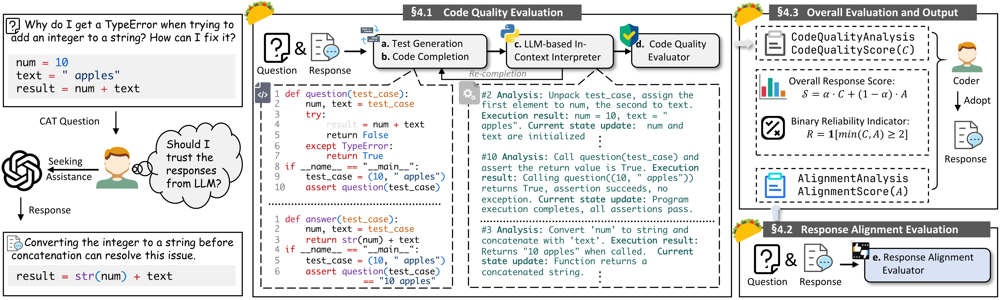

# 🌮 TACO

[](https://wengshihao.github.io/TACO/)
[](https://www.python.org/)
[](https://vite.dev/)
[](#)

We now have a new, easier-to-use release of TACO.

TACO is a reference-free trust assessment tool for LLM coding-assistance answers. It constructs executable-style checks, simulates question and answer behavior, re-completes failed question harnesses, and reports code quality, answer alignment, and a final trust indicator.



## Online Use

[Click here](https://wengshihao.github.io/TACO/) to open the hosted web app.

Fill in an OpenAI-compatible LLM endpoint, choose Python or Java, paste the user question and LLM answer, then run TACO. The online page is fully static and sends requests from your browser, so your provider must allow browser CORS.

## Quick Start

Run the same web UI locally when you want to keep API calls on your machine or avoid browser CORS issues.

```bash
git clone https://github.com/wengshihao/TACO.git
cd TACO
npm install
npm run local
```

Open:

```text
http://127.0.0.1:4173/TACO/
```

The local page has the same interface as the online app. If your LLM endpoint blocks browser requests, enable `Use local proxy`; the local server forwards requests through `/api/llm-proxy`.

## Benchmark

The release includes the benchmark data used by TACO:

- `benchmark/TACO-Eval`: real-world Python coding-assistance tasks.
- `benchmark/TACO-Judge`: human-annotated Python model responses.
- `benchmark/TACO-Judge-Java`: Java coding-assistance responses with annotations.

A benchmark index is also exposed from the web app at `/benchmark/`.

<details>
<summary><strong>CLI for benchmark and batch evaluation</strong></summary>

### Install

Use the project conda environment, then install the package:

```bash
conda activate taco
pip install -e .
```

Set an OpenAI-compatible endpoint:

```bash
export TACO_API_KEY="YOUR_API_KEY"
export TACO_BASE_URL="https://api.openai.com/v1"
export TACO_MODEL="gpt-4o-mini"
```

### Run Python Benchmark

```bash
taco run \
  --input benchmark/TACO-Judge/chatgpt4o.jsonl \
  --output outputs/taco-judge-chatgpt4o.jsonl \
  --question-field question \
  --answer-field llmanswer \
  --language python \
  --resume
```

### Run Java Benchmark

```bash
taco run \
  --input benchmark/TACO-Judge-Java/data_java_annotated.jsonl \
  --output outputs/taco-judge-java.jsonl \
  --question-field question \
  --answer-field llmanswer \
  --language java \
  --resume
```

### Useful Options

```bash
--alpha 0.5
--max-recompletion 2
--limit 10
--start 100
--concurrency 2
--no-raw
```

Each output row contains the TACO scores, final reliability indicator, and intermediate traces.

</details>

## Method

TACO uses this assessment flow:

1. Convert the user question and LLM answer into a minimal test and completed harnesses.
2. Virtually execute the question harness and answer harness.
3. Re-complete the harness when the question-side assertion fails.
4. Score code quality on a 0 to 3 rubric.
5. Score answer alignment with user intent on a 0 to 3 rubric.
6. Report `S = alpha * C + (1 - alpha) * A` and `R = 1[min(C, A) >= 2]`.

## Citation

Please cite the TACO paper when using this tool or benchmark:

```bibtex
@inproceedings{weng2026taco,
  title = {TACO: Trust Assessment of Large Language Models in Coding Assistance Tasks},
  author = {Weng, Shihao and Feng, Yang and Li, Jincheng and Yin, Yining and Zhang, Zhenlun and Liu, Lyuxi and Liu, Jia},
  booktitle = {Proceedings of the 2026 IEEE/ACM 48th International Conference on Software Engineering},
  year = {2026}
}
```
