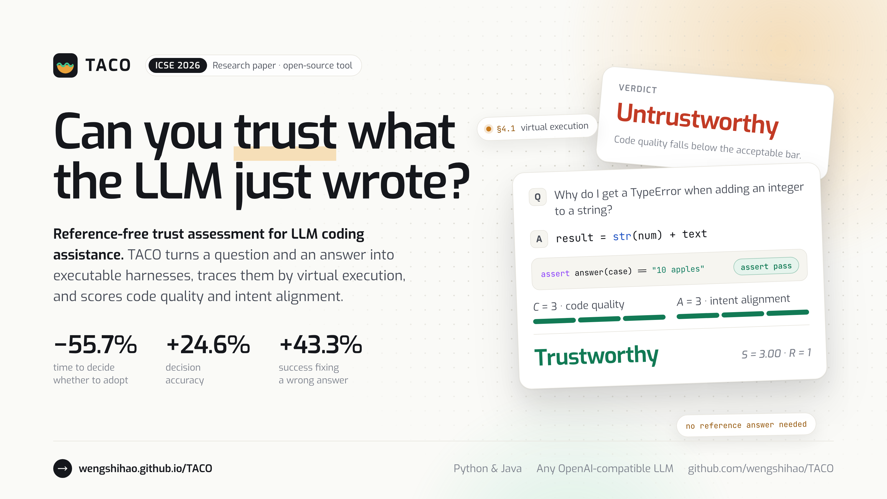
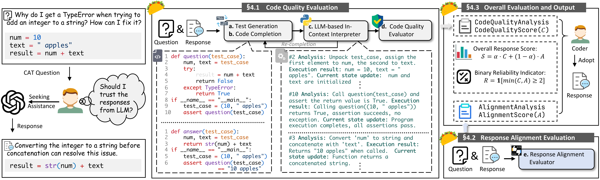

<p align="center">
  <a href="https://wengshihao.github.io/TACO/">
    
  </a>
</p>

<p align="center">
  <b>Reference-free trust assessment for LLM coding assistance.</b><br>
  Paste a question and an LLM's answer. TACO tells you whether to trust it, and why.
</p>

<p align="center">
  <a href="https://wengshihao.github.io/TACO/"><b>Live demo</b></a> &nbsp;·&nbsp;
  <a href="#quick-start"><b>Quick start</b></a> &nbsp;·&nbsp;
  <a href="#how-it-works"><b>How it works</b></a> &nbsp;·&nbsp;
  <a href="#benchmark"><b>Benchmark</b></a> &nbsp;·&nbsp;
  <a href="#citation"><b>Citation</b></a>
</p>

<p align="center">
  <a href="#citation"></a>
  <a href="https://wengshihao.github.io/TACO/"></a>
  
  
  <a href="LICENSE"></a>
</p>

---

**TACO** checks whether an LLM's answer to a coding question deserves trust, **without a reference answer**. It turns the question and the answer into executable harnesses, traces both by LLM-based virtual execution, and scores two things:

- **Code quality `C`**: does the proposed fix actually work on a test that reproduces the issue?
- **Intent alignment `A`**: does the answer address what the developer actually asked?

It returns a continuous score `S` for ranking and a conservative verdict `R` for adoption. Use it from the browser, as a local web app, or as a Python CLI and library, with any OpenAI-compatible model.

## News

- **2026-10**: The new [web playground](https://wengshihao.github.io/TACO/) is live. It shows the full pipeline live, includes human-labelled TACO-Judge examples, and needs no installation.
- **ICSE 2026**: TACO is accepted to the 48th IEEE/ACM International Conference on Software Engineering. 🎉
- **User study**: with TACO, PhD students decided whether to adopt an answer **55.7% faster** and repaired wrong answers **43.3% more successfully**. [Details ↓](#user-study)

## Quick start

| | Best for | Setup |
|---|---|---|
| 🌐 **[Browser](https://wengshihao.github.io/TACO/)** | trying TACO on a single answer | none |
| 💻 **Local web app** | the same UI without CORS limits; keeps calls on your machine | `npm run local` |
| 🐍 **CLI & Python API** | benchmarks and batch evaluation | `pip install -e .` |

### Browser

Open **[wengshihao.github.io/TACO](https://wengshihao.github.io/TACO/)**, pick a provider, and paste your API key. Load an example or paste your own question and answer, then press <kbd>⌘/Ctrl</kbd> + <kbd>Enter</kbd>.

The page is fully static, and requests go straight from your browser to your provider, so the provider must allow browser (CORS) requests. Your key stays in the current tab unless you choose to remember it.

### Local web app

```bash
git clone https://github.com/wengshihao/TACO.git && cd TACO
npm install
npm run local        # → http://127.0.0.1:4173/TACO/
```

Same interface as the hosted page. It detects the bundled local server and routes LLM calls through `/api/llm-proxy`, so providers that block browser requests work too.

### CLI

```bash
pip install -e .     # Python ≥ 3.10

export TACO_API_KEY=sk-...
export TACO_BASE_URL=https://api.openai.com/v1   # any OpenAI-compatible endpoint
export TACO_MODEL=gpt-4o-mini

taco run \
  --input  benchmark/TACO-Judge/chatgpt4o.jsonl \
  --output outputs/chatgpt4o.jsonl \
  --question-field question --answer-field llmanswer \
  --language python --concurrency 4 --resume
```

Each output line is one JSON record:

```jsonc
{
  "id": "00b0fce2…",
  "code_quality_score": 3,        // C ∈ {0,1,2,3}
  "alignment_score": 1,           // A ∈ {0,1,2,3}
  "overall_score": 2.0,           // S = α·C + (1−α)·A
  "reliability": 0,               // R = 𝟙[min(C, A) ≥ 2]
  "code_quality_analysis": "…",
  "alignment_analysis": "…",
  "intermediate": { "completion": {…}, "question_trace": {…}, "answer_trace": {…}, "raw": {…} }
}
```

<details>
<summary><b>All CLI options</b></summary>

| Option | Default | Description |
|---|---|---|
| `--language` | `python` | `python` or `java` prompts |
| `--alpha` | `0.5` | weight of code quality in `S` |
| `--max-recompletion` | `2` | re-completion attempts when the question harness fails |
| `--concurrency` | `1` | records evaluated in parallel |
| `--start`, `--limit` | `0`, all | evaluate a slice of the input |
| `--resume` | off | skip IDs already present in `--output` |
| `--no-raw` | off | drop raw LLM responses from the output |
| `--config` | – | YAML with `model`, `base_url`, `api_key_env`, `max_tokens` (see [`examples/config.example.yml`](examples/config.example.yml)) |
| `--model`, `--base-url`, `--api-key` | env | override `TACO_MODEL`, `TACO_BASE_URL`, `TACO_API_KEY` |

</details>

### Python API

```python
from taco_tool import TacoEngine
from taco_tool.llm import OpenAICompatibleClient

engine = TacoEngine(client=OpenAICompatibleClient(model="gpt-4o-mini"), language="python")
result = engine.evaluate(question=question_md, answer=llm_answer_md)

result.reliability      # 1 = trustworthy, 0 = untrustworthy
result.overall_score    # S in [0, 3]
```

## How it works

<p align="center">
  
</p>

TACO assesses an answer along two independent paths that run in parallel:

1. **Code quality (§4.1).** From the question and answer, TACO derives a minimal test and completes the snippets into two harnesses. The *question harness* reproduces the reported behaviour, and the *answer harness* applies the proposed fix. An LLM interpreter traces both line by line. If the question harness fails to reproduce the issue, TACO re-completes it using the failure as feedback. A rubric then yields `C`.
2. **Response alignment (§4.2).** A separate evaluator checks whether the answer meets the developer's intent, including constraints, scope, and the explanation asked for. It yields `A`.
3. **Output (§4.3).**

$$
S = \alpha \cdot C + (1-\alpha)\cdot A, \qquad R = \mathbb{1}\left[\min(C, A) \ge 2\right]
$$

`R` is deliberately conservative: an answer is trusted only if it is *both* correct enough and on-intent.

## Benchmark

Everything used in the paper ships in [`benchmark/`](benchmark).

| Dataset | Language | Size | Labels | |
|---|---|---|---|---|
| **TACO-Eval** | Python | 1,328 Stack Overflow tasks, with responses from 7 LLMs | accepted answers | [`benchmark/TACO-Eval`](benchmark/TACO-Eval) |
| **TACO-Judge** | Python | 1,593 responses from GPT-4o, Claude 3.5 Sonnet, Gemini 1.5 Pro, and Llama 3.1 405B | human trust labels | [`benchmark/TACO-Judge`](benchmark/TACO-Judge) |
| **TACO-Judge-Java** | Java | 100 responses | human trust labels | [`benchmark/TACO-Judge-Java`](benchmark/TACO-Judge-Java) |

Field descriptions are in [`benchmark/README.md`](benchmark/README.md). The playground's example gallery is drawn from TACO-Judge (`npm run samples`).

## User study

Six independent participants, three PhD students and three professional developers, judged and repaired LLM answers with and without TACO, about 100 answers per condition per group.

| Metric | PhD students<br>w/o → with TACO | Developers<br>w/o → with TACO |
|---|:---:|:---:|
| Decision time (min) ↓ | 11.5 → **5.1** &nbsp;(−55.7%) | 9.7 → **5.2** &nbsp;(−46.4%) |
| Decision accuracy (%) ↑ | 65.0 → **81.0** &nbsp;(+24.6%) | 73.5 → **84.0** &nbsp;(+14.3%) |
| Correction time (min) ↓ | 22.6 → **15.4** &nbsp;(−31.9%) | 18.6 → **11.4** &nbsp;(−38.7%) |
| Correction success (%) ↑ | 67.6 → **93.9** &nbsp;(+43.3%) | 75.4 → **91.3** &nbsp;(+21.1%) |
| Perceived usefulness (1–7) ↑ | **6.3** | **6.1** |

<details>
<summary>Metric definitions and participant breakdown</summary>

- **Decision time (DT)**: time to decide whether an LLM response is adoptable.
- **Decision accuracy (DA)**: correctness of that decision against the benchmark label.
- **Perceived usefulness (PU)**: participants' rating of TACO's feedback on a 7-point Likert scale.
- **Correction time (CT)**: time taken to revise an incorrect response.
- **Correction success rate (CSR)**: share of successful corrections, judged by the question's original annotator. Attempts over 30 minutes were recorded as unsuccessful, since prolonged efforts typically exceed what developers will invest in fixing unreliable LLM output.

Valid results per participant:

| | w/o TACO | with TACO | | w/o TACO | with TACO |
|---|:---:|:---:|---|:---:|:---:|
| phd-part1 | 34 | 33 | dev-part1 | 34 | 33 |
| phd-part2 | 33 | 33 | dev-part2 | 33 | 33 |
| phd-part3 | 33 | 34 | dev-part3 | 31 | 34 |
| **Total** | **100** | **100** | **Total** | **98** | **100** |

We are grateful to all six participants.

</details>

## Repository layout

```
src/          web app (React + Vite): playground, engine, prompts
taco_tool/    Python package and `taco` CLI
benchmark/    TACO-Eval, TACO-Judge, TACO-Judge-Java
scripts/      local server with LLM proxy, Pages sync, sample builder
docs/         figures and the cover (cover.html is its editable source)
```

## Citation

If TACO or its benchmarks help your work, please cite:

```bibtex
@inproceedings{weng2026taco,
  title     = {TACO: Trust Assessment of Large Language Models in Coding Assistance Tasks},
  author    = {Weng, Shihao and Feng, Yang and Li, Jincheng and Yin, Yining and Zhang, Zhenlun and Liu, Lyuxi and Liu, Jia},
  booktitle = {Proceedings of the 2026 IEEE/ACM 48th International Conference on Software Engineering},
  year      = {2026}
}
```

## License

[MIT](LICENSE)
